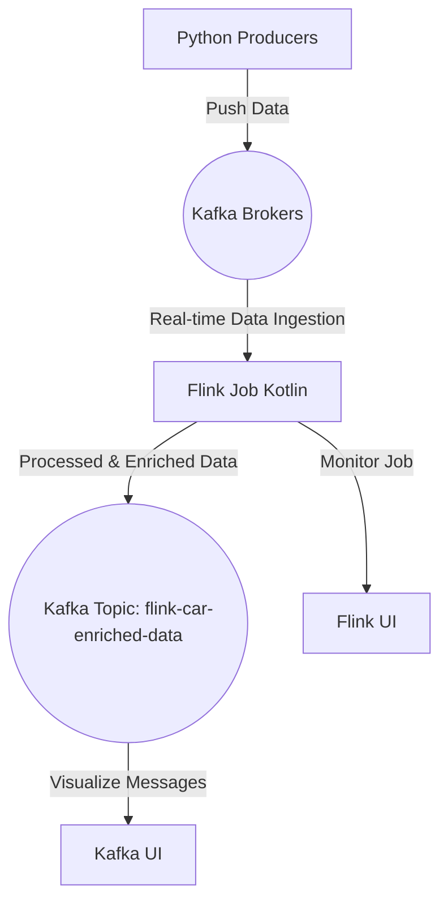

# Flink-Kafka Streaming Data Pipeline

This project demonstrates an end-to-end real-time data pipeline, integrating several technologies to handle data ingestion, processing, and monitoring. The core technologies include Kafka for streaming data, Flink for data processing, Zookeeper for Kafka broker coordination, and Python-based producers for generating the data streams. The pipeline also provides monitoring via user-friendly interfaces for both Kafka and Flink.

## Project Overview

The pipeline processes car-related data, simulating a real-time vehicle marketplace. Python scripts generate data, which is ingested by Kafka. Flink consumes and processes this data, enriching it with additional information before outputting it to new Kafka topics. The flow of data can be monitored via Kafka and Flink UIs.

### Key Components
1. **Python Producers**: Generate real-time car listing and car enrichment data streams, which are sent to Kafka topics.
2. **Kafka Cluster**: Manages the data streams, distributing them across different Kafka topics.
3. **Flink Job**: A Flink application (written in Kotlin) consumes data from Kafka, processes it, and outputs enriched data into a new Kafka topic.
4. **Flink UI**: Monitors the Flink job's health, performance metrics, and execution progress.
5. **Kafka UI**: Visualizes Kafka topics, messages, and brokers for an easy overview of data being ingested and processed.

### Data Flow Diagram



## Technologies Used

- **Apache Kafka**: A distributed event streaming platform used to handle real-time data streams.
- **Apache Flink**: A powerful stream processing engine that processes and enriches real-time data.
- **Zookeeper**: A centralized service for maintaining configuration and providing coordination among Kafka brokers.
- **Docker**: For containerizing all components (Kafka, Flink, and Zookeeper) to ensure portability and consistency across environments.
- **Python**: For implementing real-time data producers that push data into Kafka topics.
- **Kotlin**: For writing the Flink stream processing job that enriches the incoming data.
- **Kafka UI**: A user interface to monitor Kafka topics, messages, and broker information.
- **Flink UI**: A user interface to monitor Flink jobs, view performance metrics, and troubleshoot issues.

## Project Structure

The folder structure is organized as follows:

```
project-root/
  ├── CarFlink/
  │    ├── Dockerfile              # Dockerfile for building the Flink job container
  │    ├── build.gradle.kts        # Gradle build script for the Kotlin Flink job
  │    └── src/
  │         └── main/
  │              └── kotlin/
  │                  └── Main.kt   # Flink job to process and enrich data from Kafka
  ├── CarDataProducers/
  │    ├── carDataStreams.py       # Python script to generate real-time car data
  │    └── requirements.txt        # Python dependencies for data producers
  └── docker-compose.yml           # Defines all services: Kafka, Flink, Zookeeper, Python producer
```

## Prerequisites

Ensure the following are installed on your system:

1. **Docker** and **Docker Compose**: To run all services in containers.
2. **Python 3**: Required for running the data producer script.
3. **Java and Gradle** (for building the Flink job if not using the pre-built Docker image).

## Deployment Instructions

Follow these steps to deploy and run the project.

### 1. Clone the Repository

```bash
git clone https://github.com/your-username/flink-kafka-pipeline.git
cd flink-kafka-pipeline
```

### 2. Build and Start the Docker Services

Use Docker Compose to build the containers and start all services:

```bash
docker-compose up --build -d
```

This will bring up:
- **Kafka Cluster**: Comprising multiple Kafka brokers and Zookeeper.
- **Flink Cluster**: Including JobManager and TaskManager.
- **Python Producer**: A container running the Python script that generates data for Kafka.
- **Kafka UI**: Available at [http://localhost:8080](http://localhost:8080) to monitor Kafka topics.
- **Flink UI**: Available at [http://localhost:8081](http://localhost:8081) to monitor Flink jobs.

### 3. Running the Python Data Producers

If you need to run the Python data producers manually, navigate to the `CarDataProducers` directory and run the script:

```bash
cd CarDataProducers
python carDataStreams.py
```

This script will generate and push car-related data into Kafka topics (`car-listings`, `car-enrichment`).

### 4. Monitoring the Pipeline

- **Flink UI**: View the status of your Flink job at [http://localhost:8081](http://localhost:8081).
    - You can monitor task progress, check for any errors, and track performance metrics.
- **Kafka UI**: Inspect Kafka topics (`car-listings`, `car-enrichment`, `flink-car-enriched-data`) at [http://localhost:8080](http://localhost:8080).
    - This provides a detailed view of message flow and Kafka brokers.

## Customization

- **Kafka Configuration**: You can modify Kafka broker settings and topics by adjusting the `docker-compose.yml` file.
- **Flink Job Configuration**: If needed, you can modify the Flink job in `Main.kt` and rebuild the Flink Docker image.
    - Navigate to `CarFlink/` and run the following to rebuild:
      ```bash
      ./gradlew build
      docker-compose up --build
      ```

## Example Use Case

In this project, we simulate a real-time car marketplace:
- **Producers** generate car listing and enrichment data.
- **Kafka** ingests the data and makes it available to consumers.
- **Flink** processes and enriches this data, producing enriched car information to a new Kafka topic.
- The **UI dashboards** (Flink and Kafka) allow you to monitor the real-time flow and performance.

This setup can easily be adapted to other use cases like e-commerce, IoT data processing, or real-time analytics systems.

## Troubleshooting

- **Docker Services Not Starting**: Ensure that Docker is running properly and no conflicting services are using the same ports.
- **Flink Job Failing**: Check the Flink UI for error logs and ensure that the Kafka topics are being populated with data.
- **Python Producer Errors**: If there are issues with the Python script, ensure that the necessary dependencies in `requirements.txt` are installed.

